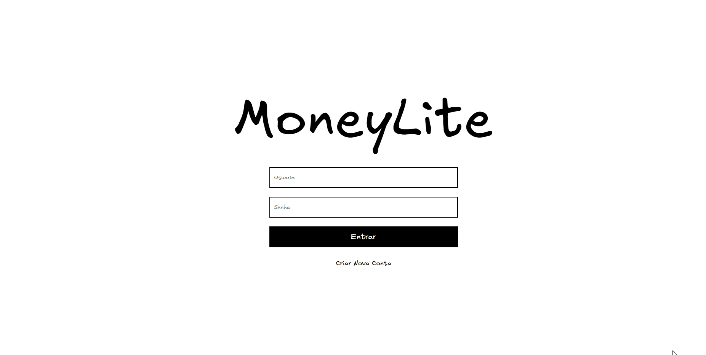

# MoneyLite – Sistema de Controle Financeiro

O **MoneyLite** é um sistema simples de **controle financeiro pessoal**, desenvolvido com foco acadêmico para **treino de PHP**, lógica de programação e integração com banco de dados.

O projeto permite o **registro e visualização de entradas (ganhos), saídas (despesas)** e acompanhamento de **metas financeiras**, simulando um cenário real de organização financeira.

---

## 🎓 Contexto do projeto
Este sistema foi desenvolvido com **viés acadêmico**, como parte do aprendizado prático de:
- PHP
- Estruturação de aplicações web
- Manipulação de dados financeiros
- Organização de código back-end

O foco principal não foi escalabilidade ou segurança avançada, mas sim **compreensão dos fundamentos da linguagem PHP e do fluxo de uma aplicação web**.

---

## 💰 Funcionalidades
- Cadastro de ganhos (entradas)
- Cadastro de despesas (saídas)
- Visualização de saldo atual
- Dashboard com resumo financeiro
- Controle de metas financeiras
- Navegação simples entre módulos

---
## 📸 Preview


---

## 🛠️ Tecnologias utilizadas
- PHP
- HTML
- CSS
- Banco de dados relacional (MySQL ou similar)
- Servidor Apache (ambiente local)

---

## 📂 Estrutura do projeto
```txt
/
├─ index.php
├─ login.php
├─ cadastro.php
├─ conexao.php
├─ dashboard/
├─ ganhos/
├─ despesa/
├─ metas/
├─ css/
├─ img/
└─ fonts/
